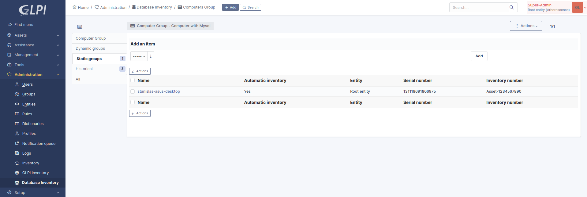
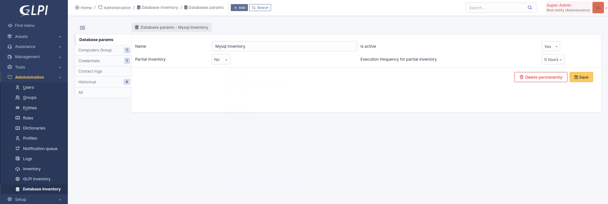
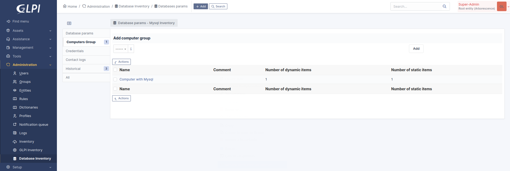

# Database inventory plugin

[French README](README_FR.md)

This plugin allows you to "manage" the Teclib' inventory agents in order to perform an inventory of the databases present on the workstation.


# Table of Contents

* [How it works](#how-it-works)
   * [Agent => GLPI](#agent-glpi)
   * [GLPI => Agent: response](#glpi-agent-response)
   * [Agent => plugin: get parameters](#agent-plugin-get-parameters)
* [Computer group](#computer-group)
   * [Dynamic group](#dynamic-group)
   * [Static group](#static-group)
* [Credentials](#credentials)
* [Task](#task)
* [Partial inventory](#partial-inventory)


## How it works

### Agent => GLPI

When the agent wakes up, it contacts the GLPI server via the ``CONTACT`` communication protocol.

```
{
  "action": "contact",
  "deviceid": "classic-agent-deviceid",
  "name": "GLPI-Agent",
  "version": "1.0",
  "installed-tasks": [
    "inventory",
    "register",
    "..."
  ],
  "enabled-tasks": [
    "collect",
    "deploy",
    "..."
  ],
  "tag": "awesome-tag"
}
```


### GLPI => Agent: response

The plugin adds the database inventory setting to the computer inventory task if required.

```
{
  "status": "<token>",
  "message": "<optional string>",
  "tasks": [
    {
      "task": "inventory",
      "params": [
        {
          "params_url": "get_databaseparams",
          "category" : "database",
          "use": [ "mysql", "oracle" ],
          "delay": "2h",
          "params_id": 1
        }
      ]
    },
  ]
}
```


### Agent => plugin: get parameters

When running the database inventory, the agent retrieves the database inventory configuration settings from the URL provided by the ``CONTACT`` protocol (``get_databaseparams``).

```
{
  "action": "get_params",
  "deviceid": "classic-agent-deviceid",
  "params_id": "id",
  "use": "mongodb",
  "name": "GLPI-Agent",
  "version": "1.0",
}
```

Example of a response:

```
{
  "credentials": [
    {
      "id": "id",
      "type": "login_password",
      "use": "mongodb",
      "login": "login",
      "password": "password"
    }
  ]
}
```


## Computer group

Allows you to define the set of items where the database inventory should be carried out.


### Dynamic group

It is possible to define a dynamic list based on a search.


### Static group

It is possible to define a static list.




## Credentials

Allows you to fill in the database connection credentials.


## Task

Allows you to set the following items:
- name;
- activation state;
- partial inventory;
- execution frequency for partial inventory;
- computer list;
- credentials list.






## Partial inventory

Partial inventory allows the agent to perform only the database inventory (without the asset inventory) according to the frequency defined in the task.
